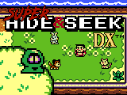

# Super Hide and Seek DX

  

**Super Hide and Seek DX** es un juego 2D desarrollado como parte de la asignatura de [Taller de Jocs Electrònics](https://tamats.com/upf/?page_id=11) usando el motor [TJE2D](https://github.com/jagenjo/TJE2D), con gráficos, controles y estética inspirados en *Zelda: Link's Awakening DX* de Game Boy Color.

> El objetivo es simple: **encontrar a todos los niños que se han escondido** por el mundo y devolverlos a casa.

---

## ¿Qué incluye el juego?

- Modo **Tutorial** con introducción y guía inicial.
- Modo **Partida Nueva** con un mapa más grande y más NPCs.
- Sistema de **diálogos** y escenas.
- **Guardado y carga** de partida.
- Ítem especial: **mantequilla**, que te permite correr a toda velocidad.
- Atajo de desarrollo para pruebas (activar todos los niños capturados).
- Estilo visual retro, con sprites y música originales de *Zelda: Link's Awakening DX*.

---

### Carga por zonas (scroll tipo Game Boy)

  

El mundo está dividido en pequeñas subzonas. Al salir de una zona por un borde (por ejemplo, al caminar hacia la derecha), el motor carga automáticamente la subzona adyacente, recreando el sistema de transición entre pantallas clásico de los *Zelda* de Game Boy. Este enfoque permite dividir el mapa en regiones más pequeñas y mejora la organización y el rendimiento.

---

## Controles

- **Flechas** – Moverse
- **Z** – Interactuar
- **X** – Abrir menú (guardar/cargar)
- **T** – Atajo de testeo (capturar todos los niños)

---

## Diseño del Mapa

El proyecto incluye una carpeta adicional llamada **`tiled_project`** con el archivo del mapa en formato `.tmx`, editable con [Tiled](https://www.mapeditor.org/), junto con los tilesets `.png` necesarios para visualizarlo correctamente.

  
  

### Capas del mapa (`worldmap.tmx`)

El mapa está compuesto por **4 capas** principales:

1. **Mapa** – La capa visual principal con los tiles de fondo.
2. **Tipo de celda** – Define el comportamiento de cada celda:  
   - `transitable`: el jugador puede caminar  
   - `bloqueo`: pared u obstáculo  
   - `npc`: celda que contiene un personaje con el que puedes hablar  
   - `warp`: celda que transporta a otra zona  
   - `objeto`: celda con un ítem especial
3. **NPCs** – Posiciones y entidades de personajes hablables.
4. **Límites de mapa** – Sirve para marcar las fronteras entre subzonas del mapa.

---

## Requisitos

- [TJE2D](https://github.com/jagenjo/TJE2D) (versión antigua usada para esta práctica incluida en el proyecto)
  > *Nota:* La versión actualizada de TJE2D está disponible en el repositorio oficial; este proyecto usa una versión antigua.

---

## Cómo ejecutar

1. Clona este repositorio:

   git clone [https://github.com/hunter-digi-ace/Super\_Hide\_and\_Seek\_DX-TJE2D](https://github.com/hunter-digi-ace/Super_Hide_and_Seek_DX-TJE2D)

   cd Super\_Hide\_and\_Seek\_DX
2. Compila el proyecto siguiendo las instrucciones del archivo `README-TJE2D.md` incluido en el repositorio.
   - Revisa el archivo INSTALL.md.
3. Ejecuta el juego y disfruta.